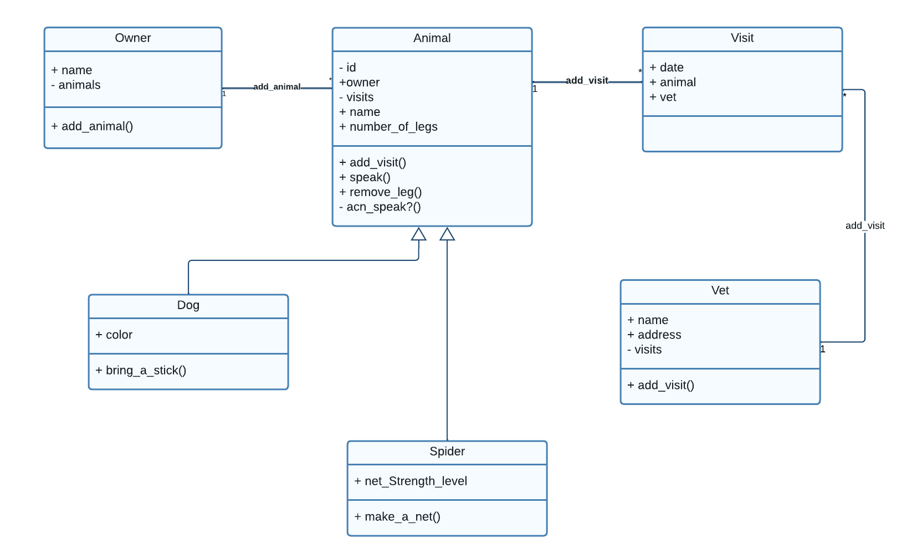

<a name="readme-top"></a>

# 📗 Table of Contents
- [📗 Table of Contents](#-table-of-contents)
- [📖 OOP School Library ](#-oop-school-library-)
  - [🛠 Built With ](#-built-with-)
    - [Tech Stack ](#tech-stack-)
  - [🚀 UML Diagram ](#-uml-diagram-)
  - [💻 Getting Started ](#-getting-started-)
    - [Prerequisites](#prerequisites)
    - [Setup](#setup)
    - [Install](#install)
    - [Usage ](#usage-)
  - [👥 Author ](#-author-)
  - [🤝 Contributing ](#-contributing-)
  - [⭐️ Show your support ](#️-show-your-support-)
  - [📝 License ](#-license-)

<!-- PROJECT DESCRIPTION -->

# 📖 OOP School Library <a name="about-the-project"></a>
 This project is dedicated to learn the basics of _four Object Oriented Programming (OOP) Principles_

 - Abstraction
 - Encapsulation
 - Polymorphism
 - Inheritance

## 🛠 Built With <a name="built-with"></a>

### Tech Stack <a name="tech-stack"></a>

<details>
  <summary>Client</summary>
  <ul> 
    <li><a href="https://www.ruby-lang.org/en/">Ruby</a></li>
    <li><a href="https://github.com/microverseinc/linters-config/tree/master/ruby">Linters</a></li>
  </ul>
</details>

## 🚀 UML Diagram <a name="uml-diagram"></a>



<p align="right">(<a href="#readme-top">back to top</a>)</p>

<!-- GETTING STARTED -->

## 💻 Getting Started <a name="getting-started"></a>

### Prerequisites

In order to run this project you need:

- [Ruby](https://www.ruby-lang.org/en/) installed and running. To get more information, read the [installation instructions](https://github.com/microverseinc/curriculum-ruby/blob/main/simple-ruby/articles/ruby_installation_instructions.md).
- You should be able to use [IRB](https://en.wikipedia.org/wiki/Ruby_(programming_language)#Features).
### Setup

Clone this repository to your desired folder:

```
  git clone git@github.com:KanzaTahreem/OOP-Principles.git
  cd OOP-Principles
```

### Install

Install thr project dependencies with:

```
  bundle install
```

### Usage <a name="usage"></a>

To run the project, execute the following command:

```
  ruby [file_name].rb
```

<p align="right">(<a href="#readme-top">back to top</a>)</p>

<!-- AUTHORS -->

## 👥 Author <a name="authors"></a>

- GitHub: [@KanzaTahreem](https://github.com/KanzaTahreem)
- Twitter: [@kanza_tahreem](https://twitter.com/kanza_tahreem)
- LinkedIn: [Kanza Tahreem](https://www.linkedin.com/in/kanza-tahreem/)

<p align="right">(<a href="#readme-top">back to top</a>)</p>

<!-- CONTRIBUTING -->

## 🤝 Contributing <a name="contributing"></a>

Contributions, issues, and feature requests are welcome!

Feel free to check the [issues page](https://github.com/KanzaTahreem/OOP-Principles/issues).

<p align="right">(<a href="#readme-top">back to top</a>)</p>

<!-- SUPPORT -->

## ⭐️ Show your support <a name="support"></a>

If you like this project and want to support me make cooler projects Give this project a Star.

<p align="right">(<a href="#readme-top">back to top</a>)</p>

<!-- LICENSE -->

## 📝 License <a name="license"></a>

This project is [MIT](./LICENSE) licensed.

<p align="right">(<a href="#readme-top">back to top</a>)</p>